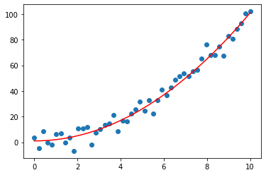
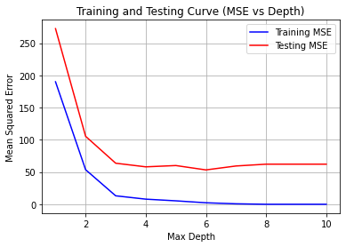

### Question 1

Show plots for bias and variance vs increasing complexity (depth) of decision tree on the given regression dataset. You can use the decision tree implementation from assignment 1 (or sklearn tree).

```python
import numpy as np

np.random.seed(1234)
x = np.linspace(0, 10, 50)
eps = np.random.normal(0, 5, 50)
y = x**2 +1 + eps

#for plotting
import matplotlib.pyplot as plt
plt.plot(x, y, 'o')
plt.plot(x, x**2 + 1, 'r-')
plt.show()
```

#### Solution

The toy data used for training and testing is as follows -



The training and testing curve with respect to mean squared error and increasing complexity is as follows -

`Train-test split = 70:30` 



The bias-varience vs depth curve is as follows -


##### Reference

Estimator. (2023, February 7). In *Wikipedia*. https://en.wikipedia.org/wiki/Estimator
