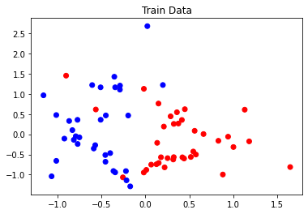
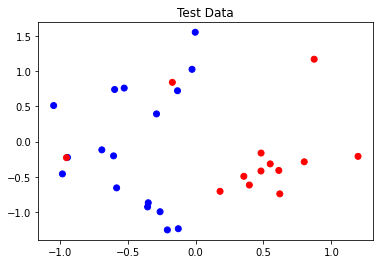
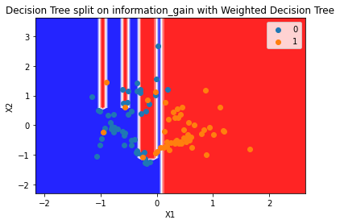
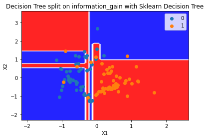
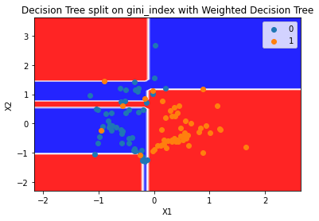
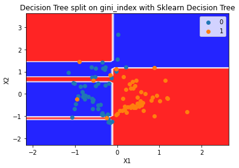

### Question 2

Shuffle the dataset and split the classification dataset into a training set (70%) and a test set (30%). Implement a weighted decision tree and train it using the training set. Use uniform(0,1) distribution to assign weights randomly to the samples. Plot and visualise the decision tree boundary. Use the test set to evaluate the performance of the weighted decision tree and compare your implementation with sklearn. You can copy your implementation of decision tree from assignment 1 to this repository and edit it to take sample weights as an argument while learning the decision tree(Default weight is 1 for each sample).

```python
from sklearn.datasets import make_classification
X, y = make_classification(
n_features=2, n_redundant=0, n_informative=2, 
random_state=1, n_clusters_per_class=2, class_sep=0.5)

# For plotting
import matplotlib.pyplot as plt
plt.scatter(X[:, 0], X[:, 1], c=y)
```

##### Soultuion

The data used for training and testing looks like -





`Criterion = information_gain`

**Metrics for Weighted Decision Tree**

```
Training metrics
Accuracy:  1.0

Class:  1
	Precision:  1.0
	Recall:  1.0

Class:  0
	Precision:  1.0
	Recall:  1.0

Testing metrics
Accuracy:  0.7666666666666667

Class:  1
	Precision:  0.6875
	Recall:  0.8461538461538461

Class:  0
	Precision:  0.8571428571428571
	Recall:  0.7058823529411765
```



**Metrics for Sklearn Implementation**

```
Training metrics
Accuracy:  1.0

Class:  1
	Precision:  1.0
	Recall:  1.0

Class:  0
	Precision:  1.0
	Recall:  1.0

Testing metrics
Accuracy:  0.7333333333333333

Class:  1
	Precision:  0.6666666666666666
	Recall:  0.7692307692307693

Class:  0
	Precision:  0.8
	Recall:  0.7058823529411765
```



`Criterion = gini_index`

**Metrics for Weighted Decision Tree**

```
Training metrics
Accuracy:  1.0

Class:  1
	Precision:  1.0
	Recall:  1.0

Class:  0
	Precision:  1.0
	Recall:  1.0

Testing metrics
Accuracy:  0.8

Class:  1
	Precision:  0.7333333333333333
	Recall:  0.8461538461538461

Class:  0
	Precision:  0.8666666666666667
	Recall:  0.7647058823529411
```



**Metrics for Sklearn Implementation**

```
Training metrics
Accuracy:  1.0

Class:  1
	Precision:  1.0
	Recall:  1.0

Class:  0
	Precision:  1.0
	Recall:  1.0

Testing metrics
Accuracy:  0.8

Class:  1
	Precision:  0.7333333333333333
	Recall:  0.8461538461538461

Class:  0
	Precision:  0.8666666666666667
	Recall:  0.7647058823529411
```


