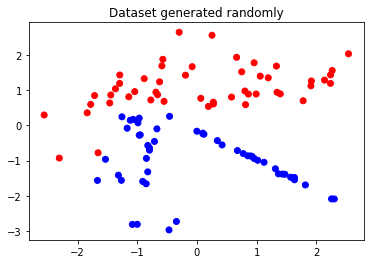
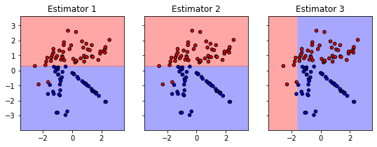
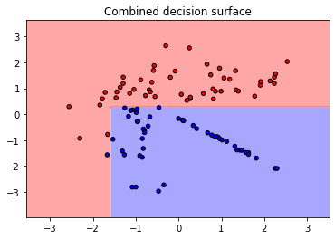

### Question 3

**`Part A`**

Implement Adaboost on Decision Stump (depth=1 tree). You can use Decision Tree learnt in assignment 1 or sklearn decision tree and solve it for the case of real input and discrete output. Edit `ensemble/ADABoost.py` 

##### Solution

The dataset used for tarining looks like -

`Number of samples = 100` `Number of features = 2` `Number of classes = 2` `Numbeer of estimators = 3` `Criteria = gini`



The performace of the model can be comprehended as -

```
Criteria  : gini
Accuracy  : 0.99

Class     : 0
Precision : 1.0
Recall    : 0.98

Class     : 1
Precision : 0.9803921568627451
Recall    : 1.0
```

<hr>

**`Part B`**

Implement AdaBoostClassifier on classification data set. Plot the decision surfaces and compare the accuracy of AdaBoostClassifier using 3 estimators over decision stump. Include your code in `q3_ADABoost.py`.

##### Solution

The dataset used for tarining looks like -

`Number of samples = 100` `Number of features = 2` `Number of classes = 2` `Numbeer of estimators = 3` `Criteria = gini`


Decision surfaces of the indivisual estimators -



The combined decision surface looks like -


