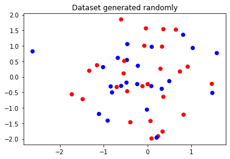
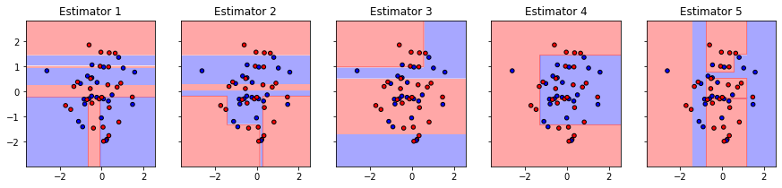
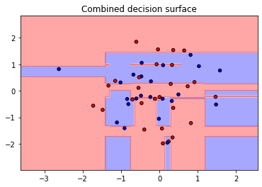
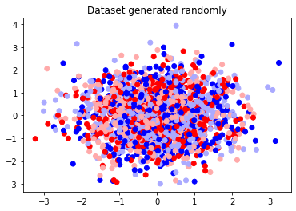
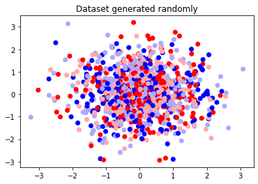
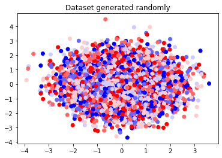

### Question 4

**`Part A`** Implement Bagging(BaseModel, num_estimators): where base model is the DecisionTree you had implemented in assignment 1 (or sklearn decision tree). In a later assignment, you would have to implement the above over LinearRegression() also, but for now you only have to implement it for Decision Trees. Edit `ensemble/bagging.py`. Use `q4_Bagging.py` for testing.

##### Soultion

The toy dataset which is used for training the model is as follows -

`Number of samples = 50`  `Number of features = 2`  `Number of classes = 2`  `Number of estimators = 5`  `Max depth of each estimator = 20`



The decision boundries of each estimator is as follows -



The combined decision boundary is as follows -



The performce of the model can be estimated from the following results

```
Criteria   : gini
Accuracy   : 0.82

Class      : 0
Precision  : 0.8181818181818182
Recall     : 0.782608695652174

Class      : 1
Precision  : 0.8214285714285714
Recall     : 0.8518518518518519
```

<hr>

**`Part B`** Implement bagging in parallel fashion, where each decision tree is learnt simultaneously. Perform timing analysis for parallel implementation and normal implementation.

##### Solution

**`Study 1`**

The toy dataset which is used for training both the model is as follows -

`Number of samples = 2000` `Number of features = 2` `Number of classes = 4` `Number of estimators = 20` `Max depth of each estimator = 20`



The performace and time required for tarining of the models can be compared from the following metrics -

```
Criteria            : gini
Accuracy Sequencial : 0.5385
Accuracy Parallel   : 0.536

Time elapsed in sequencial execution : 0.1579 seconds
Time elapsed in parallel execution   : 0.1095 seconds
```

**`Study 2`**

The toy dataset which is used for training both the model is as follows -

`Number of samples = 500` `Number of features = 2` `Number of classes = 4` `Number of estimators = 50` `Max depth of each estimator = 100`



The performace and time required for tarining of the models can be compared from the following metrics -

```
Criteria            : gini
Accuracy Sequencial : 0.683
Accuracy Parallel   : 0.678

Time elapsed in sequencial execution : 0.9955 seconds
Time elapsed in parallel execution   : 0.5297 seconds
```

**`Study 3`**

The toy dataset which is used for training both the model is as follows -

`Number of samples = 10000` `Number of features = 2` `Number of classes = 6` `Number of estimators = 500` `Max depth of each estimator = 1000`



The performace and time required for tarining of the models can be compared from the following metrics -

```
Criteria            : gini
Accuracy Sequencial : 0.457
Accuracy Parallel   : 0.4561

Time elapsed in sequencial execution : 32.3758 seconds
Time elapsed in parallel execution   : 27.2234 seconds
```
