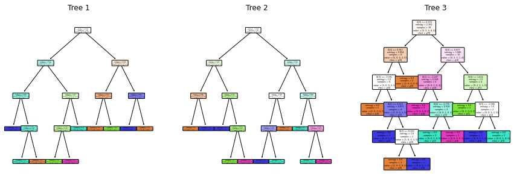
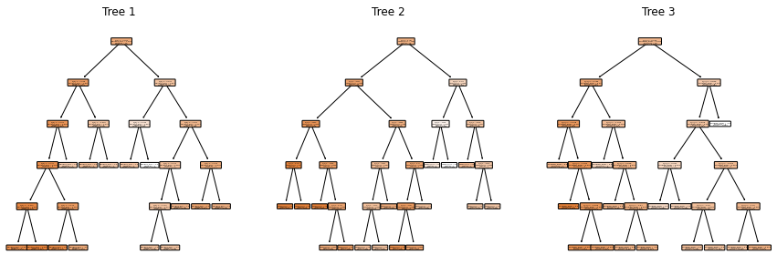
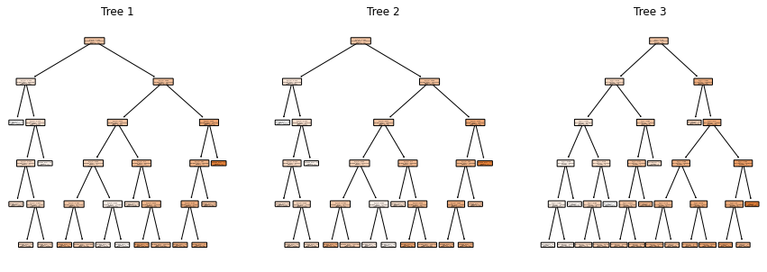
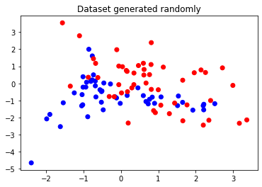
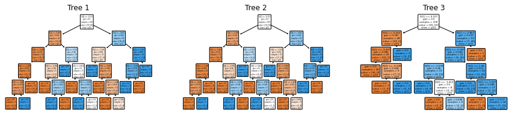
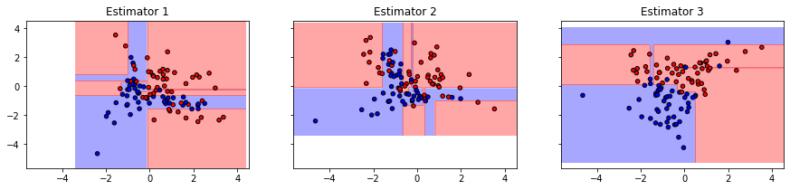
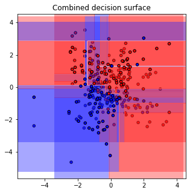

### Question 5

**`Part A`**

Implement RandomForestClassifier() and RandomForestRegressor() classes in `tree/randomForest.py`. Use `q5_RandomForest.py` for testing.

##### Solution

Random forest classifier over `entropy` as criterion returns the following trees as output -

`Number of samples = 30` `Number of features = 5` `Sampling = row sampling`

`Max Depth = 5` `Number of estimators = 3` `Number of classes = 5`

The performace of the model can be quantified as -

```
Criteria  : entropy
Accuracy  : 0.8333333333333334

Class 0
Precision : 0.7777777777777778
Recall    : 0.7777777777777778

Class 3
Precision : 0.875
Recall    : 1.0

Class 2
Precision : 1.0
Recall    : 0.7142857142857143

Class 4
Precision : 0.6
Recall    : 0.75

Class 1
Precision : 1.0
Recall    : 1.0
```

<br>

Random forest classifier over `gini` as criterion returns the following trees as output -

`Number of samples = 30` `Number of features = 5` `Sampling = row sampling`

`Max Depth = 5` `Number of estimators = 3` `Number of classes = 5`


The performace of the model can be quantified as -

```
Criteria  : gini
Accuracy  : 0.8333333333333334

Class 0
Precision : 0.875
Recall    : 0.7777777777777778

Class 3
Precision : 1.0
Recall    : 0.7142857142857143

Class 2
Precision : 0.875
Recall    : 1.0

Class 4
Precision : 1.0
Recall    : 0.75

Class 1
Precision : 0.5
Recall    : 1.0
```

<br>

Random forest classifier over `squared_error` as criterion returns the following trees as output -

`Number of samples = 30` `Number of features = 5` `Sampling = row sampling`

`Max Depth = 5` `Number of estimators = 3`



The performace of the model can be quantified as -

```
Criteria : squared_error
RMSE     : 0.5159266120836465
MAE      : 0.364302808727380
```

<br>

Random forest classifier over `squared_error` as criterion returns the following trees as output -

`Number of samples = 30` `Number of features = 3` `Sampling = column sampling`

`Max Depth = 5` `Number of estimators = 3`



The performace of the model can be quantified as -

```
Criteria : squared_error
RMSE     : 40.52918401932447
MAE      : 24.29257288596476
```

<hr>

**`Part B`**

Generate the plots for classification data set. Include you code in `random_forest_classification.py`

##### Solution

The toy dataset used for tarining is as follows -



Random forest classifier over `gini` as criterion returns the following trees as output -

`Number of samples = 100` `Number of features = 3` `Sampling = column sampling`

`Max Depth = 5` `Number of estimators = 3` `Number of classes = 2`



The decision surfaces for the corrosponding estimators is as follows -



The combined decision surface is as follows -



The performace of the model can be quantified as -

```
Criteria  : gini
Accuracy  : 0.91

Class 1
Precision : 1.0
Recall    : 0.88

Class 0
Precision : 1.0
Recall    : 0.94
```
