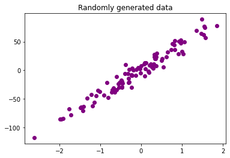
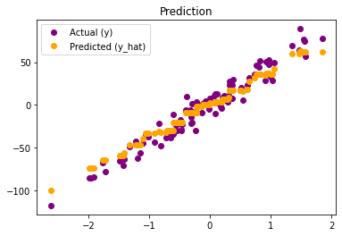

### Question 6

Implement Gradient Boosted Decision trees on the regression dataset given below. You need to edit the `ensemble/gradientBoosted.py` and `q6_gradientBoosted.py`

```python
from sklearn.datasets import make_regression

X, y= make_regression(
    n_features=3,
    n_informative=3,
    noise=10,
    tail_strength=10,
    random_state=42,
)

# For plotting
import matplotlib.pyplot as plt
plt.scatter(X[:, 0], y)
```

##### Solution

The rabdomly generated data for the training looks like -



We trained an ensamble with gradient boosted decision tree upon the given data with the following parameters -

`Criteria = squared_error` `Number of estimators = 20` `Learning rate = 0.1`  `Max depth = 3`


The performace of the model can be comprehended with the following results -



```
Criteria : squared_error
RMSE     : 8.74626791232833
MAE      : 7.075693381159919
```


